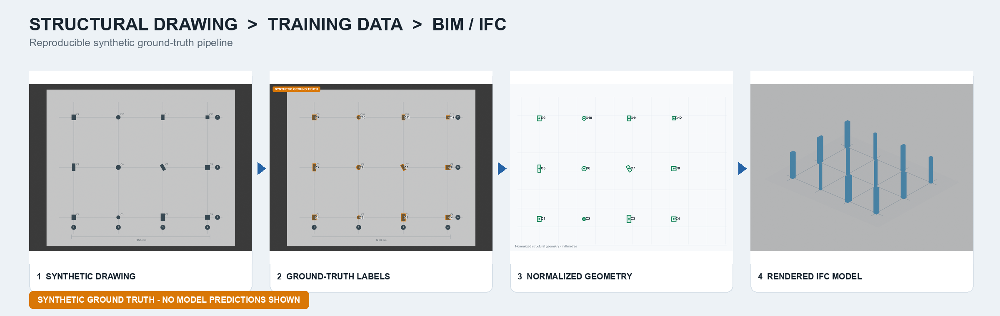
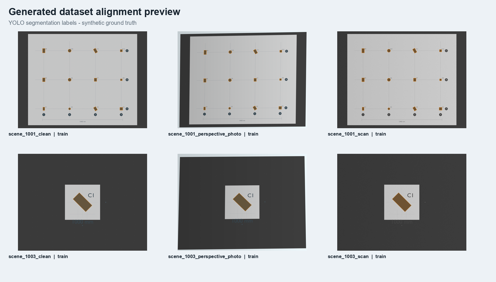

# Struct2BIM Synthetic Lab



Struct2BIM is a reproducible reference pipeline for turning structural floor-plan documents into detector-ready data and calibrated BIM/IFC geometry. It generates structural drawings in Blender, derives exact labels from the same canonical scene, validates every artifact, and exports IFC4 and DXF without requiring AutoCAD.

The repository is also prepared for local YOLO segmentation/OBB training, evaluation, and supplied-checkpoint inference. **No trained weights or detector metrics are included or claimed.** Public visuals marked _Synthetic Ground Truth_ show generated truth, not model predictions.

## What is implemented

| Capability | Status |
|---|---|
| Blender structural drawing generation | Implemented |
| Isolated, regular, and irregular layout curriculum | Implemented |
| Clean, scan, and perspective document variants | Implemented in a separate 2D stage |
| YOLO segmentation and oriented-box labels | Implemented |
| Semantic/instance masks, metadata, hashes, grouped splits | Implemented |
| Canonical metric structural JSON | Implemented |
| IFC4 and DXF export with reopen validation | Implemented |
| Image, multi-page PDF, and basic DXF inference adapters | Implemented; weights supplied by user |
| Local training, resume, evaluation, and inference commands | Prepared; optional ML environment not installed by default |
| Direct DWG input | Deferred; export DWG to DXF or PDF first |



## Pipeline

```text
Canonical metric scene
   |-- Blender clean drawing
   |-- exact polygons / OBB / masks
   |-- document augmentation + transformed labels
   |-- grouped train / validation / test dataset
   `-- normalized geometry --> DXF + IFC4 --> reopen validation

Image / PDF / DXF --> supplied YOLO checkpoint --> pixel predictions
                                            `--> calibrated scene + IFC (when scale is known)
```

One coordinate transform is authoritative for the clean render and its labels. Perspective augmentation applies the same homography to pixels and annotations. Variants from the same structural scene always stay in one dataset split.

## Quick start

Requirements: Windows or Linux, Python 3.11, [uv](https://docs.astral.sh/uv/), and Blender 4.2 or a compatible Blender executable.

```powershell
uv sync --extra dev
$env:STRUCT2BIM_BLENDER = "C:\path\to\blender.exe"
uv run struct2bim doctor
uv run struct2bim showcase --output outputs\showcase
uv run struct2bim generate --config configs\curricula\reference.yaml --output outputs\dataset
uv run struct2bim validate-dataset --dataset outputs\dataset
uv run struct2bim preview-dataset --dataset outputs\dataset
uv run python scripts/release_audit.py
```

For this local workspace, `scripts/bootstrap.ps1` uses the ignored portable tools under `.tools/` and reproduces the base environment without installing the optional training stack.

## Outputs

A dataset build produces:

- shared images and task-specific YOLO directory trees;
- segmentation polygons and four-corner OBB labels;
- semantic and instance PNG masks;
- canonical scene JSON and DXF per underlying scene;
- per-sample augmentation metadata and homography;
- SHA-256 hashes and a deterministic manifest;
- non-empty, scene-grouped train/validation/test splits;
- a validation report that is written from actual checks.

Small verified examples are in [`examples/reference`](examples/reference). Full datasets, model weights, runs, Blender installations, and virtual environments are intentionally ignored.

## Optional local model workflow

Training packages are isolated from the base environment:

```powershell
.\.tools\uv\uv.exe venv .venv-training --python 3.11
.\.tools\uv\uv.exe pip install --python .venv-training\Scripts\python.exe -r requirements-training.txt
.\.tools\uv\uv.exe pip install --python .venv-training\Scripts\python.exe -e .
.\.venv-training\Scripts\struct2bim.exe train --config configs\training\columns-seg.yaml
```

Evaluation and inference require a real checkpoint:

```powershell
struct2bim evaluate --weights path\to\best.pt --dataset outputs\dataset --data outputs\dataset\segment\dataset.yaml
struct2bim infer --source drawing.pdf --weights path\to\best.pt
struct2bim infer --source drawing.dxf --weights path\to\best.pt --mm-per-pixel 2.5
```

Without `--mm-per-pixel`, inference deliberately stays in pixel space. IFC generation is enabled only after a real-world scale is supplied.

See [training and inference](docs/training.md), [architecture](docs/architecture.md), [data contract](docs/data-contract.md), and [limitations](docs/limitations.md).

## Scope and engineering position

This is a portfolio-quality vertical slice, not a structural-design authority or production drawing-certification system. The included ruleset uses structural vocabulary and plausible demonstrative ranges; it does not certify compliance with any current building code. Human engineering review remains required before using generated BIM in design or construction.

The initial detector ontology focuses on rectangular and circular columns. Grid axes, bubbles, identifiers, and dimensions are generated as context and retained in canonical data so later task heads can extend the same architecture.

## License

Project code is MIT licensed. Optional or direct dependencies retain their own licenses; see [THIRD_PARTY_NOTICES.md](THIRD_PARTY_NOTICES.md), especially the Ultralytics and PyMuPDF terms.
