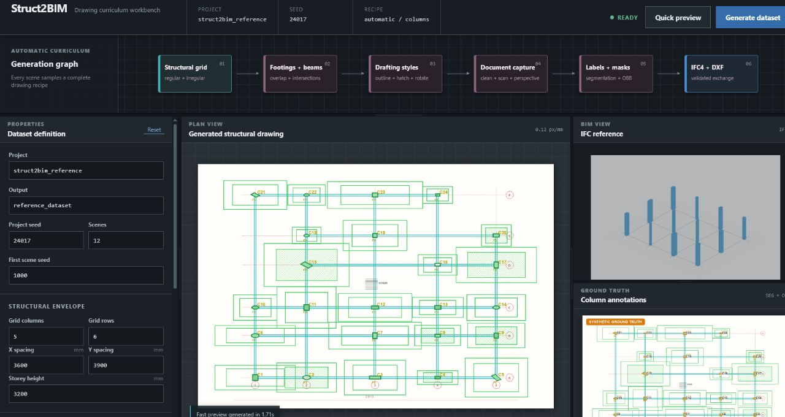
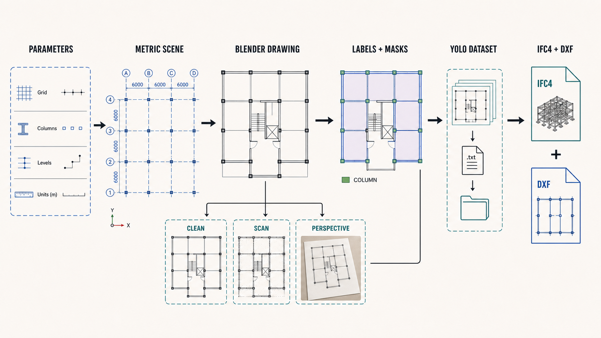

# Struct2BIM

Struct2BIM explores a practical route from structural floor plans to BIM-ready geometry. The project generates configurable floor-plan drawings in Blender, derives exact annotations from their source geometry, and exports the same scene as IFC4 and DXF.

The current implementation focuses on structural columns and grid systems. It covers the complete data path around a detector: curriculum generation, document variations, YOLO segmentation and oriented-box labels, grouped dataset splits, input adapters, scale calibration, and validated exchange models.



## Features

- Browser-based generator with controls for layouts, variants, drawing scale, grid size, spacing, storey height, and irregularity
- Blender drawing generation from one metric scene definition
- Isolated, regular-grid, and irregular-grid curriculum stages
- Clean, scanned-document, and perspective variants
- Exact YOLO segmentation and oriented-box annotations
- Semantic masks, instance masks, scene metadata, and file hashes
- Scene-grouped train, validation, and test splits to prevent variant leakage
- IFC4 and DXF export with reopen validation
- Image, multi-page PDF, and basic DXF input adapters
- Local commands for YOLO training, evaluation, and checkpoint-based inference

## How it works



The clean drawing and its annotations use the same coordinate transform. Perspective variants apply one homography to both pixels and labels. Every variant from an underlying structural scene remains in the same dataset split.


## Generator interface

The local interface exposes the parameters that define a run and provides two workflows:

- **Build one preview** renders a selected scene and prepares its IFC and DXF outputs.
- **Generate dataset** runs the complete curriculum, writes the dataset, and validates the result.

Start it with:

```powershell
uv sync --extra dev
$env:STRUCT2BIM_BLENDER = "C:\path\to\blender.exe"
uv run struct2bim serve
```

Then open [http://127.0.0.1:8765](http://127.0.0.1:8765).

The repository also includes a Windows bootstrap script for the ignored portable development tools used in this workspace:

```powershell
powershell.exe -NoProfile -ExecutionPolicy Bypass -File .\scripts\bootstrap.ps1
```

## Reference run

The checked reference configuration contains 12 underlying scenes and 36 rendered variants. Its grouped split contains 30 training samples, 3 validation samples, and 3 test samples. A total of 72 YOLO annotation files are checked during dataset validation.


The same metric scene is exported to IFC4 and DXF. Both files are reopened with their respective libraries after export, so a successful run verifies more than file creation.


Small verified artifacts are available in [`examples/reference`](examples/reference). Generated datasets, model weights, training runs, Blender installations, and virtual environments stay outside version control.

## Command line workflow

```powershell
uv run struct2bim doctor
uv run struct2bim showcase --output outputs\showcase
uv run struct2bim generate --config configs\curricula\reference.yaml --output outputs\dataset
uv run struct2bim validate-dataset --dataset outputs\dataset
uv run struct2bim preview-dataset --dataset outputs\dataset
uv run python scripts/release_audit.py
```

A dataset build writes:

- images and task-specific YOLO directory trees
- segmentation polygons and four-corner oriented boxes
- semantic and instance masks
- canonical structural scene JSON and DXF files
- augmentation metadata and homographies
- deterministic manifests and SHA-256 hashes
- a validation report produced from the completed checks

## Model training and inference

Training is intentionally separated from the base development environment. Install the optional packages on the machine that will perform the training:

```powershell
.\.tools\uv\uv.exe venv .venv-training --python 3.11
.\.tools\uv\uv.exe pip install --python .venv-training\Scripts\python.exe -r requirements-training.txt
.\.tools\uv\uv.exe pip install --python .venv-training\Scripts\python.exe -e .
.\.venv-training\Scripts\struct2bim.exe train --config configs\training\columns-seg.yaml
```

Evaluation and inference use a supplied checkpoint:

```powershell
struct2bim evaluate --weights path\to\best.pt --dataset outputs\dataset --data outputs\dataset\segment\dataset.yaml
struct2bim infer --source drawing.pdf --weights path\to\best.pt
struct2bim infer --source drawing.dxf --weights path\to\best.pt --mm-per-pixel 2.5
```

Inference remains in pixel space when no real-world scale is known. IFC generation is enabled after scale calibration. The repository does not include trained weights or publish detector metrics.

## Project structure

```text
configs/                  curriculum and training configurations
docs/                     architecture, data contract, and verification notes
examples/reference/       small reopened IFC and DXF examples
scripts/                  setup, verification, and release checks
src/struct2bim/
  adapters/               image, PDF, and DXF inputs
  blender/                drawing and scene generation
  exporters/              IFC4 and DXF writers
  training/               dataset, training, and inference commands
  web/                    local generator interface
tests/                    unit and integration tests
```

## Verification

```powershell
uv run pytest
uv run ruff check .
uv run mypy src scripts
uv run struct2bim doctor
uv run python scripts/release_audit.py
```

The committed IFC is reopened with IfcOpenShell, and the DXF is reopened with ezdxf. Dataset validation checks coordinates, expected artifacts, hashes, masks, annotations, and split grouping. More detail is available in [verification](docs/verification.md), [architecture](docs/architecture.md), and the [data contract](docs/data-contract.md).
